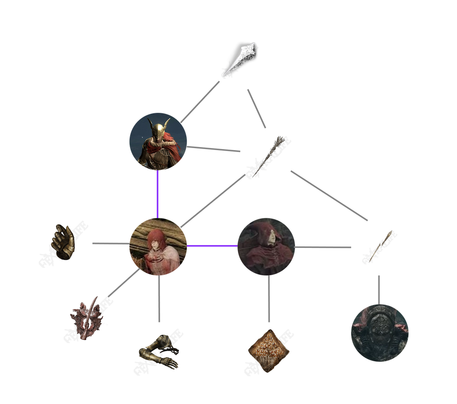

# https://soulsborne.build/

> soulsborne.build is a website focused on the soulsborne series (Dark Souls, Bloodborne, Elden Ring) which aims to centralize community created content like builds and character appearances as well as some interesting lore data visualization.

Join the Discord server to follow the project or contribute: https://discord.com/invite/hw9x6ujjPk

## Features

You can view the backlog and roadmap here: https://github.com/users/KeziahMoselle/projects/2/views/1

### Elden Ring

- Share and vote **builds**
- Share and vote **fashion** (character appearances) (WIP)
- Share and vote **sliders** (character sliders)
- Lore graph tree, an easy to understand relational graph of items/NPCs (WIP)
  - 

### In the future

- Support for more games
  - Dark Souls
  - Dark Souls II
  - Dark Souls III
  - Bloodborne

## Stack

### Front-end

#### https://soulsborne.build/

- [Astro](https://astro.build/)
- [Vue.js](https://vuejs.org/)
  - Used on interactive and complex components like the `<Builder />`
- [Radix Vue](https://www.radix-vue.com/)
  - With [shadcn-vue](https://www.shadcn-vue.com/)
- [TailwindCSS](https://tailwindcss.com/)

### Back-end

#### https://payload.soulsborne.build/admin/

- [PayloadCMS v3](https://payloadcms.com/)
- [Postgres](https://www.postgresql.org/)

### Other services

- [Umami Analytics](https://umami.is/)
  - https://umami.keziahmoselle.fr/share/cOXVzDt0ojdNQbAS/soulsborne.build
- [Uptime Kuma](https://github.com/louislam/uptime-kuma)
  - https://uptime.keziahmoselle.fr/status/all

### Hosting

- **Astro** app is hosted on [Cloudflare Pages](https://pages.cloudflare.com/)
  - The frontend is running in server mode so it makes use of [Cloudflare workers](https://workers.cloudflare.com/)
- **Next.js** PayloadCMS app is hosted on an OVH VPS managed by [Coolify](https://coolify.io/)
- **Assets** uploaded to PayloadCMS are uploaded to [Cloudflare R2](https://www.cloudflare.com/developer-platform/r2/)
  - `cdn.soulsborne.build`

## Contributing

### Requirements

Install globally:

- [Docker](https://www.docker.com/)
  - For the step 3.
- [Node.js](https://nodejs.org/en/download) (>20.x)
- [pnpm](https://pnpm.io/)
- `npm i concurrently -g`

### Steps

1. Copy the `.env.example` file to `.env` in both `backend` and `frontend` directories and fill in the values

2. Install the dependencies via pnpm in `/backend`

```bash
pnpm install
```

And in `/frontend` directory:

```bash
npm install
```

3. Start the local PostgreSQL database by running (in `/backend` directory)

```bash
start-database.sh
```

1. Run the development server for both the backend and frontend directories at root run this:

```bash
pnpm dev
```

5. (optional) You can seed some initial data by visiting http://localhost:3000/api/seed (this is currently being migrated into a separate script in `/backend/src/scripts/seed.ts`)

6. Open the project
   1. PayloadCMS is accessible here: http://localhost:3000/admin
   2. Astro is accessible here: http://localhost:4321/
